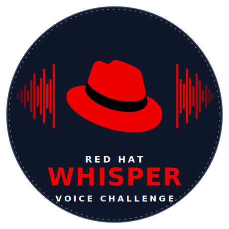

<p align="center">
  
</p>

<h1 align="center">Red Hat Whisper Voice Challenge</h1>

An interactive voice transcription game for conference booths and demos. Attendees speak challenge phrases into a microphone, and an AI model (Whisper) transcribes their speech in real time. The game scores accuracy using Levenshtein distance and tracks live GPU/AI metrics on a dashboard.

Built for Red Hat employees to deploy at conferences worldwide. Runs on OpenShift AI with vLLM and supports 20+ languages out of the box.

## System Requirements

### Platform

| Component | Version | Notes |
|-----------|---------|-------|
| OpenShift | 4.14+ | Or Kubernetes 1.27+ with KServe installed manually |
| Red Hat OpenShift AI (RHOAI) | 2.9+ | Provides KServe, ServingRuntime, InferenceService CRDs |
| NVIDIA GPU Operator | — | For GPU node management and DCGM metrics exporter |
| User Workload Monitoring | — | Must be enabled for persistent metrics (optional but recommended) |

### Hardware

| Component | Requirement |
|-----------|-------------|
| GPU | 1x NVIDIA GPU with 12+ GB VRAM (tested on L40S 48GB) |
| GPU node label | `node-role.kubernetes.io/gpu-worker=true` |
| Model memory | ~24 GB RAM for vLLM pod (includes KV cache overhead) |
| UI pod | 256Mi-512Mi RAM, 0.25-1 CPU core |

### Model Weights

Model weights are pulled automatically from the Red Hat registry as an OCI modelcar image — **no S3 bucket or Data Connection needed**.

Default: `oci://registry.redhat.io/rhelai1/modelcar-whisper-large-v3-turbo-quantized-w4a16:1.5`

### Client Tools

- `oc` CLI (logged into the cluster, **cluster-admin** required)
- `helm` 3.x
- `podman` or `docker` (for building the UI container image)
- Access to `registry.redhat.io` (requires Red Hat subscription, for vLLM runtime and modelcar images)
- A container registry you can push to (e.g., `quay.io`, `ghcr.io`)

## Quick Start

```bash
# Clone the repo
git clone https://github.com/agiertli/redhat-whisper-voice-challenge.git
cd redhat-whisper-voice-challenge

# Deploy (builds container, pushes to registry, installs via Helm)
./deploy.sh
```

The script checks prerequisites, builds the container image, pushes it, and deploys via Helm. See `./deploy.sh --help` for configuration options.

## Installation (Step by Step)

### 1. Prerequisites

Ensure you have an OpenShift cluster with:
- RHOAI / OpenDataHub operator installed
- NVIDIA GPU Operator installed on GPU nodes
- Cluster-admin access (needed for ClusterRole/ClusterRoleBinding creation)

> **Red Hatters**: The fastest path is [RHDP](https://demo.redhat.com) — order **"RHOAI on OCP on AWS with NVIDIA GPUs"**, enable **Open Environment**, select **g6.4xlarge** instance type. This gives you RHOAI and GPU nodes pre-configured. Open Environment lets you add more GPU nodes via the MachineSet API.

### 2. Configure

Edit `helm/whisper-ui/values.yaml`:

```yaml
# REQUIRED: your cluster's apps domain
# Find it with: oc get ingresses.config cluster -o jsonpath='{.spec.domain}'
clusterDomain: "apps.my-cluster.example.com"

conference:
  name: "Your Conference 2026"

game:
  requiredLanguage: "sk"    # Default challenge language code
  challengeCount: "5"       # Challenges per game
  winThreshold: "4"         # Wins needed to complete
```

The Whisper API URL is constructed automatically from `clusterDomain` and `whisperApi.modelName`. Model weights are pulled from the Red Hat registry as an OCI modelcar image — no S3 or Data Connection setup needed.

### 3. Deploy

The Helm chart deploys **everything in one shot** — the UI app, vLLM ServingRuntime, Whisper InferenceService (with OCI modelcar), RBAC for Prometheus, and monitoring config.

A pre-built UI image is available at `quay.io/agiertli/whisper-ui` — you don't need to build anything unless you've modified the source code.

```bash
# Deploy using the pre-built image (no build needed)
helm upgrade --install whisper helm/whisper-ui \
  --namespace whisper --create-namespace

# Or build your own image and deploy:
IMAGE_REGISTRY=quay.io/your-org ./deploy.sh
```

### 4. Verify

The InferenceService takes a few minutes on first deploy (pulls model weights from Red Hat registry).

```bash
# Wait for the model to be ready
oc wait --for=condition=Ready inferenceservice/whisper -n whisper --timeout=600s

# Get the UI URL
oc get route whisper-ui -n whisper -o jsonpath='{.spec.host}'
```

## Running the Game at a Booth

A quick guide for the person moderating the game at the conference booth.

### Setup

1. Open the game URL on a laptop/tablet connected to an external monitor or TV
2. Use a decent USB microphone — built-in laptop mics work but pick up too much background noise
3. Set the browser to fullscreen (F11) for the best booth presentation

### Game Flow

1. **Attendee approaches the booth** — the game shows the main screen with the conference name and a "Start" button
2. **Select difficulty** — Easy (familiar languages), Medium (broader set), Hard (includes CJK, Arabic, Thai)
3. **Each round**: A challenge phrase appears on screen. The attendee clicks the microphone button, speaks the phrase, and the AI transcribes it in real time
4. **Scoring**: The transcription is compared to the expected phrase using Levenshtein distance. 90%+ accuracy = success (green), 70-89% = good (blue), below 70% = needs improvement (orange)
5. **Winning**: Complete the required number of successful challenges (default: 4 out of 5) to win
6. **Prize screen**: Winners see a congratulations screen with a prize tier based on difficulty

### Tips for Moderators

- The game works best in a **reasonably quiet environment** — loud music or crowds hurt transcription accuracy
- **Non-native speakers struggling with unfamiliar languages is half the fun** — encourage attendees to try languages they don't speak, the results are hilarious and it keeps people at the booth longer
- The `/architecture` endpoint shows an interactive architecture diagram — great for technical conversations while attendees wait
- The metrics panel on the right side of the game screen shows live GPU stats — useful for talking about the AI infrastructure
- If transcription accuracy seems poor, check that the microphone is close enough and the language selection matches what's being spoken

## Customization

This game is designed to be forked and customized for different conferences, languages, and branding.

### Challenge Phrases

The phrases that attendees must speak are defined in **`challenges.json`** at the repo root. This is the main file you'll edit when adapting the game for your conference.

The default phrases are Red Hat / OpenShift / DevOps themed (e.g., "Red Hat leads in open source innovation", "Kubernetes simplifies application deployment") in 20+ languages. Edit them to match your conference theme:

```json
{
  "en": [
    "OpenShift is great product",
    "Red Hat leads in open source innovation",
    "Artificial intelligence transforms business"
  ],
  "de": [
    "OpenShift ist ein großartiges Produkt",
    "Red Hat führt bei Open Source Innovation",
    "Künstliche Intelligenz transformiert Geschäfte"
  ]
}
```

Each key is a language code, and the value is an array of phrases. The game randomly picks from these phrases during challenges. You need at least as many phrases per language as `game.challengeCount` in your Helm values.

After editing `challenges.json`, rebuild and redeploy:
```bash
./deploy.sh
```

### Conference Name & Language

Set via Helm values (no code changes needed):

```bash
helm upgrade whisper helm/whisper-ui \
  --set conference.name="DevConf 2026" \
  --set game.requiredLanguage="cs"
```

### Supported Languages

The following languages ship with challenge phrases in `challenges.json`:

| Code | Language | Phrases |
|------|----------|---------|
| `ar` | Arabic | 3 |
| `cs` | Czech | 9 |
| `de` | German | 9 |
| `en` | English | 9 |
| `es` | Spanish | 9 |
| `fr` | French | 9 |
| `hi` | Hindi | 3 |
| `hu` | Hungarian | 9 |
| `it` | Italian | 3 |
| `ja` | Japanese | 3 |
| `ko` | Korean | 3 |
| `nl` | Dutch | 3 |
| `pl` | Polish | 9 |
| `pt` | Portuguese | 3 |
| `ro` | Romanian | 3 |
| `sk` | Slovak | 9 |
| `sv` | Swedish | 3 |
| `th` | Thai | 3 |
| `tr` | Turkish | 9 |
| `uk` | Ukrainian | 3 |
| `zh` | Chinese | 3 |

Languages with only 3 phrases won't work with the default `challengeCount: 5` — either add more phrases or lower the count.

The language dropdown in the UI is configured separately via `supportedLanguages` in `values.yaml` (controls which languages appear in the dropdown, independent of `challenges.json`):

```yaml
supportedLanguages: |
  {
    "en": "English",
    "cs": "Čeština",
    "de": "Deutsch",
    "es": "Español"
  }
```

### Branding (CSS)

The UI uses CSS custom properties for colors. Edit `src/templates/index.html`:

```css
:root {
    --red-hat-red: #ee0000;
    --ux-black: #151515;
}
```

Fonts are loaded from Google Fonts (Red Hat Display, Red Hat Text, Red Hat Mono).

### Difficulty

Adjust in `values.yaml`:

| Value | Default | Description |
|-------|---------|-------------|
| `game.challengeCount` | 5 | Number of challenges per game |
| `game.winThreshold` | 4 | Minimum wins to complete |
| `game.requiredLanguage` | en | Default challenge language |

See [docs/CUSTOMIZATION.md](docs/CUSTOMIZATION.md) for the full customization guide including GPU config, model variants, and registry setup.

## Architecture

```
Browser ──WAV──▶ Flask UI ──WAV──▶ Whisper (vLLM on OpenShift AI)
                    │                        │
                    │◀──── JSON transcript ◀──┘
                    │
                    ├──▶ Prometheus (Thanos) ──▶ persistent metrics
                    └──▶ DCGM Exporter ──▶ real-time GPU gauges
```

- **Frontend**: Single-page HTML/CSS/JS with Web Audio API and VAD-based chunking
- **Backend**: Python Flask (Gunicorn), proxies audio to vLLM Whisper API
- **Model**: `whisper-large-v3-turbo-quantized.w4a16` served via KServe InferenceService
- **Metrics**: Request counts and latencies persisted in Prometheus (survive pod restarts), GPU stats from NVIDIA DCGM exporter

The app also serves an interactive architecture diagram at `/architecture` — useful for technical presentations and booth demos. [Preview it here.](https://htmlpreview.github.io/?https://github.com/agiertli/redhat-whisper-voice-challenge/blob/main/docs/architecture-diagram.html)

See [docs/ARCHITECTURE.md](docs/ARCHITECTURE.md) for the full architecture documentation.

## Configuration Reference

All Helm values:

| Value | Default | Description |
|-------|---------|-------------|
| `image.repository` | `quay.io/agiertli/whisper-ui` | UI container image |
| `image.tag` | `v1.0.0` | Image tag (semver) |
| `namespace` | `whisper` | Target namespace |
| `clusterDomain` | — | Cluster apps domain (REQUIRED) |
| `whisperApi.modelName` | `whisper` | InferenceService name |
| `conference.name` | `Red Hat Whisper Voice Challenge` | Display name |
| `game.requiredLanguage` | `en` | Default game language |
| `game.challengeCount` | `5` | Challenges per game |
| `game.winThreshold` | `4` | Wins to complete |
| `supportedLanguages` | JSON | Language dropdown options |
| `gpu.memoryUtilization` | `0.2` | vLLM GPU memory fraction |
| `model.storageUri` | `oci://registry.redhat.io/...` | OCI modelcar URI for model weights |
| `model.nodeSelector` | L40S | GPU node selector |
| `vllm.image` | `quay.io/modh/vllm:rhoai-2.25-cuda` | vLLM runtime image |
| `dcgmExporterUrl` | cluster-internal | DCGM metrics endpoint |
| `thanosQuerier.url` | cluster-internal | Thanos querier endpoint |

## vLLM Compatibility

| vLLM Version | Status | Notes |
|-------------|--------|-------|
| 0.11.0 (RHOAI 2.x) | Working | Clean, accurate transcriptions |
| 0.13.0 (RHOAI 3.x) | Working | Requires `--max-model-len=4096` (set in Helm chart) |

The Helm chart includes the correct vLLM arguments. If you change the vLLM image, ensure `--max-model-len=4096` is set to avoid hallucinations from the default 448 token limit.

## License

Apache License 2.0. See [LICENSE](LICENSE).
