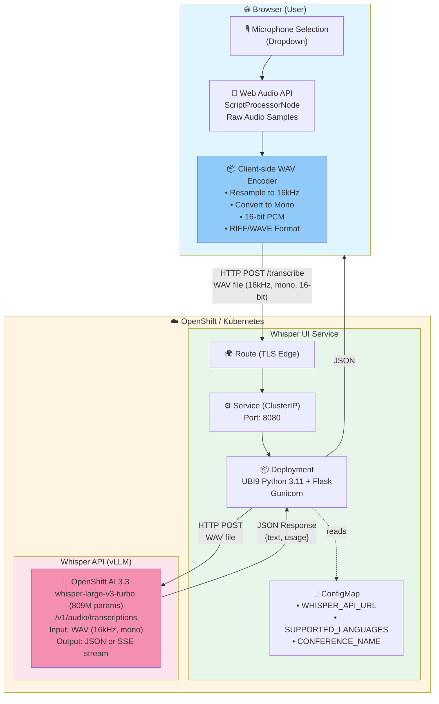
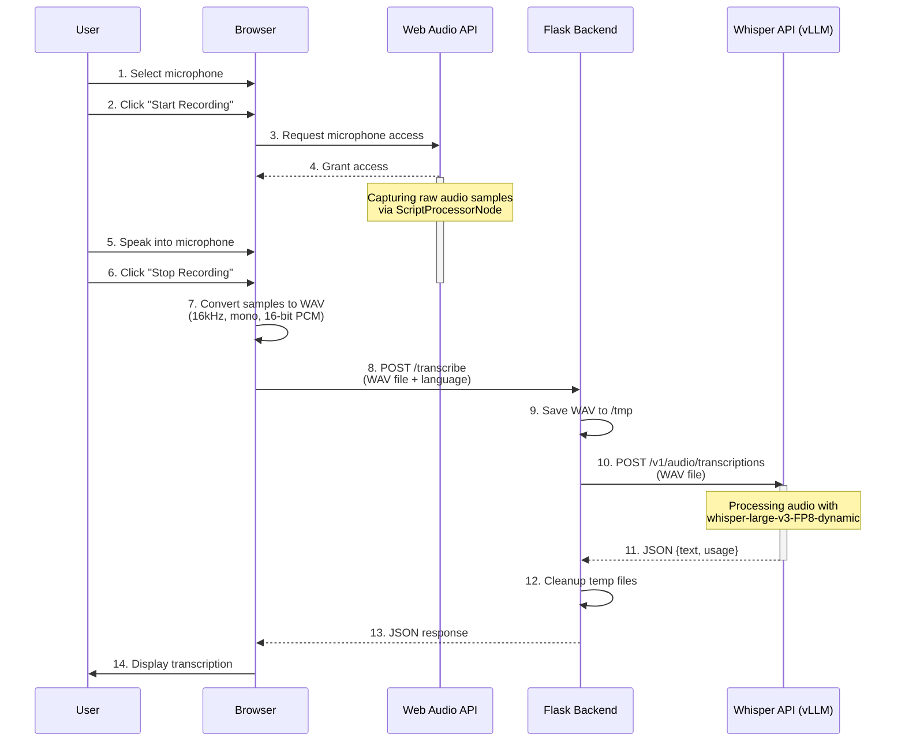
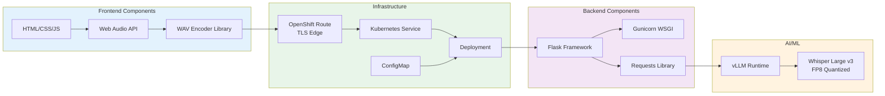
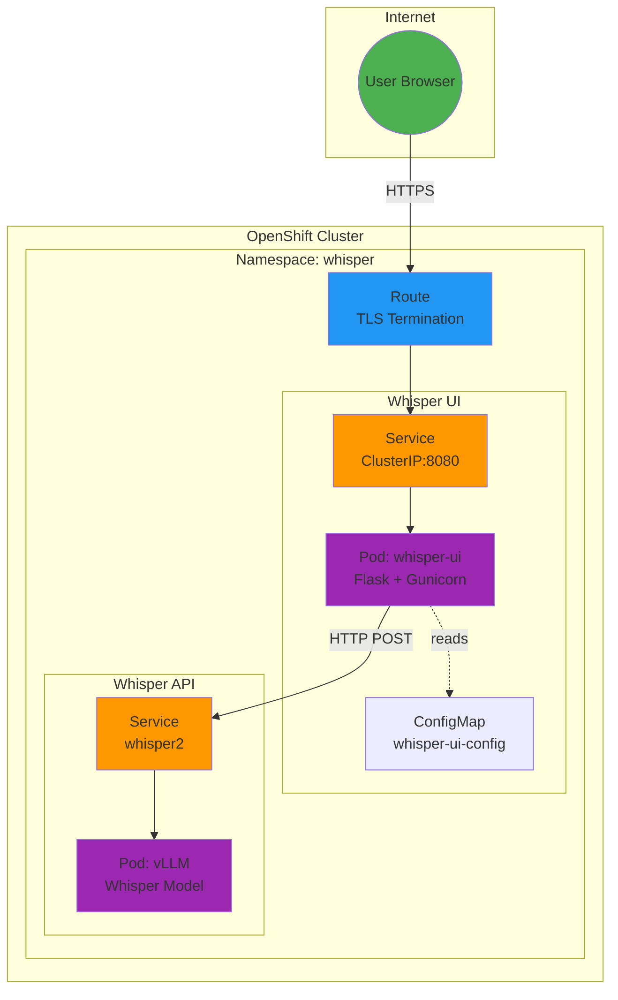

# Architecture

The Red Hat Whisper Voice Challenge is a Flask web application that captures audio in the browser, sends it to a Whisper speech-to-text model running on OpenShift AI via vLLM, and displays real-time metrics from Prometheus and NVIDIA DCGM.

## System Architecture Diagram



## Data Flow



## Component Details



## Technology Stack

| Layer | Technology | Purpose |
|-------|-----------|---------|
| **Frontend** | Web Audio API | Audio capture & processing |
| | JavaScript | WAV encoding & UI logic |
| | HTML/CSS | User interface |
| **Backend** | Flask 3.0.3 | Web framework |
| | Gunicorn 22.0.0 | WSGI server |
| | Python 3.11 | Runtime |
| **Container** | UBI9 Python 3.11 | Base image |
| | Podman/Docker | Build tool |
| **Platform** | OpenShift 4.x | Kubernetes platform |
| | Helm 3.x | Package manager |
| **AI/ML** | Whisper Large v3 Turbo | Speech-to-text model (809M params) |
| | vLLM 0.13 | Model serving runtime with SSE streaming |
| | OpenShift AI 3.3 | ML platform |

## Audio Processing Pipeline


## Challenge Scoring (Game Mode)

The root route (`/`) serves an interactive voice challenge with accuracy scoring.

### Scoring Algorithm

**Levenshtein Distance-based Similarity:**

1. **Text Normalization** (before comparison):
   ```javascript
   - Convert to lowercase
   - Trim whitespace
   - Remove punctuation: .,!?;:
   - Normalize multiple spaces to single space
   ```

2. **Edit Distance Calculation:**
   - Character-by-character comparison
   - Counts minimum edits needed (insertions, deletions, substitutions)
   - Classic dynamic programming algorithm

3. **Similarity Score Formula:**
   ```
   similarity = (longer.length - editDistance) / longer.length
   accuracy = similarity × 100
   ```

4. **Visual Feedback:**
   - **≥90%** = Green (Success) + Prize notification
   - **70-89%** = Blue (Good)
   - **<70%** = Orange (Needs improvement)

### Example Scoring

| Expected | Transcribed | Edit Distance | Accuracy |
|----------|-------------|---------------|----------|
| "openshift je skvelý produkt" | "openshift je skvely produkt" | 1 | 96.7% |
| "red hat ai" | "redhat ai" | 1 | 90.0% |
| "artificial intelligence" | "artifical inteligence" | 3 | 87.0% |

### Limitations

- **Word order sensitive**: "Red Hat AI" vs "AI Red Hat" = lower score
- **No semantic understanding**: "vehicle" vs "car" treated as completely different
- **Space-sensitive**: Missing/extra spaces affect score
- **Character-level**: Works well for typos, not for paraphrasing

### Implementation Location

- **File**: `src/templates/index.html`
- **Functions**: `levenshteinDistance()`, `levenshteinSimilarity()`
- **Execution**: Client-side JavaScript (no backend processing)

## Deployment Architecture


